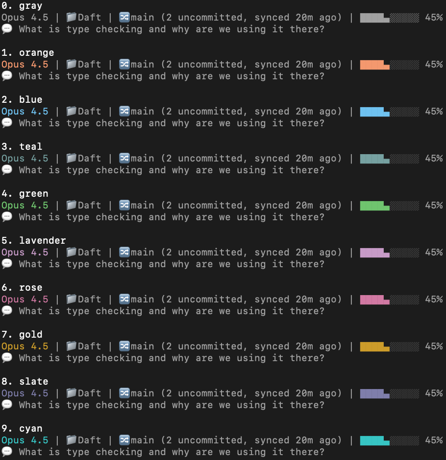

# 40+ Claude Code Tips: 基礎から上級まで

[English version](README.en.md)

> **注意**: このリポジトリは [ykdojo/claude-code-tips](https://github.com/ykdojo/claude-code-tips) の日本語版です。オリジナルのライセンスと権利については元リポジトリを参照してください。
>
> **追記**: Tip 0〜43はfork元（ykdojo）が作成したものです。Tip 44以降はkenimo49が追加したものです。

Claude Codeを最大限に活用するためのTips集です。カスタムステータスライン、システムプロンプトの半減、Gemini CLIをClaude Codeの部下として使う方法、コンテナ内でのClaude Code実行なども含まれています。[dxプラグイン](#dxプラグインのインストール)も提供しています。

📺 [クイックデモ](https://www.youtube.com/watch?v=hiISl558JGE) - マルチClaude ワークフローと音声入力の実演：

[](https://www.youtube.com/watch?v=hiISl558JGE)

<!-- TOC -->
## Table of Contents

- [Tip 0: ステータスラインをカスタマイズする](#tip-0-)
- [Tip 1: 基本的なスラッシュコマンドを覚える](#tip-1-)
- [Tip 2: 音声でClaude Codeと会話する](#tip-2-claude-code)
- [Tip 3: 大きな問題を小さく分解する](#tip-3-)
- [Tip 4: GitとGitHub CLIをプロのように使う](#tip-4-gitgithub-cli)
- [Tip 5: AIのコンテキストは牛乳のようなもの。新鮮で凝縮されているのが一番！](#tip-5-ai)
- [Tip 6: ターミナルから出力を取り出す](#tip-6-)
- [Tip 7: ターミナルエイリアスでクイックアクセス](#tip-7-)
- [Tip 8: コンテキストを積極的に圧縮する](#tip-8-)
- [Tip 9: 自律タスクには書き込み-テストサイクルを完結させる](#tip-9--)
- [Tip 10: Cmd+AとCtrl+Aはあなたの味方](#tip-10-cmdactrla)
- [Tip 11: ブロックされたサイトにはGemini CLIをフォールバックとして使用](#tip-11-gemini-cli)
- [Tip 12: 自分のワークフローに投資する](#tip-12-)
- [Tip 13: 会話履歴を検索する](#tip-13-)
- [Tip 14: ターミナルタブでマルチタスク](#tip-14-)
- [Tip 15: システムプロンプトをスリム化する](#tip-15-)
- [Tip 16: Git worktreeで並列ブランチ作業](#tip-16-git-worktree)
- [Tip 17: 長時間ジョブには手動エクスポネンシャルバックオフ](#tip-17-)
- [Tip 18: Claude Codeをライティングアシスタントとして使う](#tip-18-claude-code)
- [Tip 19: Markdownは最強](#tip-19-markdown)
- [Tip 20: Notionを使ってリンクを保持して貼り付け](#tip-20-notion)
- [Tip 21: 長時間でリスクのあるタスクにはコンテナを使用](#tip-21-)
- [Tip 22: Claude Codeを使いこなすには使い続けること](#tip-22-claude-code)
- [Tip 23: 会話を複製・半複製する](#tip-23-)
- [Tip 24: realpathで絶対パスを取得](#tip-24-realpath)
- [Tip 25: CLAUDE.md、スキル、スラッシュコマンド、プラグインの違いを理解する](#tip-25-claudemd)
- [Tip 26: インタラクティブなPRレビュー](#tip-26-pr)
- [Tip 27: Claude Codeをリサーチツールとして使う](#tip-27-claude-code)
- [Tip 28: 出力を検証する様々な方法をマスターする](#tip-28-)
- [Tip 29: Claude CodeをDevOpsエンジニアとして使う](#tip-29-claude-codedevops)
- [Tip 30: CLAUDE.mdはシンプルで簡潔に保つ](#tip-30-claudemd)
- [Tip 31: Claude Codeは万能インターフェース](#tip-31-claude-code)
- [Tip 32: 適切な抽象レベルを選ぶことがすべて](#tip-32-)
- [Tip 33: 許可したコマンドを監査する](#tip-33-)
- [Tip 34: たくさんテストを書く（TDDを使う）](#tip-34-tdd)
- [Tip 35: 未知に勇敢に、反復的に問題解決](#tip-35-)
- [Tip 36: Bashコマンドとエージェントをバックグラウンドで実行](#tip-36-bash)
- [Tip 37: パーソナライズソフトウェアの時代が来た](#tip-37-)
- [Tip 38: 入力ボックスのナビゲーションと編集](#tip-38-)
- [Tip 39: 計画に時間をかけつつ、素早くプロトタイプも作る](#tip-39-)
- [Tip 40: 複雑すぎるコードをシンプルにする](#tip-40-)
- [Tip 41: 自動化の自動化](#tip-41-)
- [Tip 42: 知識を共有し、できるところで貢献する](#tip-42-)
- [Tip 43: 学び続ける！](#tip-43-)
- [Tip 44: CLAUDE.mdの階層的な読み込みを活用する](#tip-44-claudemd)
- [Tip 45: WSL2からPowerShellコマンドを実行する](#tip-45-wsl2powershell)
- [dxプラグインのインストール](#dx)

<!-- /TOC -->

## Tip 0: ステータスラインをカスタマイズする

Claude Codeの下部にあるステータスラインをカスタマイズして便利な情報を表示できます。私の設定では、モデル名、現在のディレクトリ、Gitブランチ（あれば）、未コミットファイル数、originとの同期状態、トークン使用量のプログレスバーを表示しています。また、最後のメッセージを表示する2行目もあり、会話の内容を確認できます：

```
Opus 4.5 | 📁claude-code-tips | 🔀main (scripts/context-bar.sh uncommitted, synced 12m ago) | ██░░░░░░░░ 18% of 200k tokens
💬 This is good. I don't think we need to change the documentation as long as we don't say that the default color is orange el...
```

これはコンテキスト使用量を常に把握し、何をしていたか思い出すのに特に役立ちます。スクリプトは10色のテーマ（orange、blue、teal、green、lavender、rose、gold、slate、cyan、gray）をサポートしています。



セットアップには、[このサンプルスクリプト](scripts/context-bar.sh)を使用し、[セットアップ手順](scripts/README.md)を確認してください。

## Tip 1: 基本的なスラッシュコマンドを覚える

ビルトインのスラッシュコマンドがたくさんあります（`/`を入力すると一覧表示）。知っておくべきものをいくつか紹介：

### /usage

レート制限を確認：

```
 Current session
 ███████                                            14% used
 Resets 3:59pm (Asia/Tokyo)

 Current week (all models)
 █████████████                                      26% used
 Resets Jan 3, 2026, 5:59am (Asia/Tokyo)
```

### /chrome

Claudeのネイティブブラウザ統合を切り替え：

```
> /chrome
Chrome integration enabled
```

### /mcp

MCP（Model Context Protocol）サーバーを管理：

```
 Manage MCP servers
 1 server

 ❯ 1. playwright  ✔ connected · Enter to view details

 MCP Config locations (by scope):
  • User config (available in all your projects):
    • /Users/yk/.claude.json
```

### /stats

GitHub風のアクティビティグラフで使用統計を表示：

```
      Jan Feb Mar Apr May Jun Jul Aug Sep Oct Nov Dec
      ·············································▒▒▒▓▒░█
  Mon ··············································▒█░▓░█
      ·············································▒▒██▓░█
  Wed ·············································░▒█▒▓░█
      ············································░▓▒█▓▓░
  Fri ············································░▓░█▓▓█
      ············································▓▒░█▓▒█

      Less ░ ▒ ▓ █ More

  Favorite model: Opus 4.5        Total tokens: 12.1m

  Sessions: 1.8k                  Longest session: 20h 40m 45s
  Current streak: 44 days         Longest streak: 45 days
  Active days: 49/51              Peak hour: 17:00-18:00

  You've used ~145x more tokens than Brave New World
```

### /clear

会話をクリアして新規開始。

## Tip 2: 音声でClaude Codeと会話する

タイピングより音声の方がはるかに速くコミュニケーションできることがわかりました。ローカルマシンで音声認識システムを使うと非常に便利です。

Macでは、いくつかのオプションを試しました：
- [superwhisper](https://superwhisper.com/)
- [MacWhisper](https://goodsnooze.gumroad.com/l/macwhisper)
- [Super Voice Assistant](https://github.com/ykdojo/super-voice-assistant)（オープンソース、Claude Codeで構築）

ホストサービスを使えばより高い精度が得られますが、ローカルモデルでもこの目的には十分な強さです。認識ミスやタイポがあっても、Claudeは言いたいことを理解できるほど賢いです。特定の言葉を特にはっきり言う必要がある時もありますが、全体的にローカルモデルは十分に機能します。

例えば、このスクリーンショットでは、「ExcelElanishMark」や「advast」のような誤認識を、Claudeが「exclamation mark」と「Advanced」として正しく解釈できています：


これは友人とコミュニケーションを取ろうとしているように考えるのが一番良いと思います。もちろん、テキストでコミュニケーションできます。それが楽な人もいますし、メールでも全然OKです。Claude Codeでもほとんどの人がそうしているようです。でも、もっと速くコミュニケーションしたいなら、電話をかけるのはどうでしょう？ボイスメッセージを送るだけでもいいです。Claude Codeと文字通り電話をする必要はありません。ボイスメッセージをたくさん送るだけです。少なくとも私にとっては速いです。しかし、大多数の人にとっても速いと思います。

よくある反論は「他の人がいる部屋ではどうする？」です。イヤホンを使って小声で話しています - 個人的にはApple EarPods（AirPodsではなく）が好きです。手頃で、十分な品質で、静かにささやくだけです。他の人の前でやったことがありますが、うまくいきます。オフィスでは人が話すものです - 同僚と話す代わりに、静かに音声認識システムに話しかけるだけです。問題ないと思います。この方法は飛行機の中でも使えるほどうまくいきます。他の人には聞こえないくらい静かですが、マイクに十分近づいて話せば、ローカルモデルはまだ理解できます。（実際、この段落自体をその方法でフライト中に書いています。）

## Tip 3: 大きな問題を小さく分解する

これはマスターすべき最も重要な概念の一つです。従来のソフトウェアエンジニアリングと全く同じです - 最高のソフトウェアエンジニアはすでにこれを知っており、Claude Codeにも適用されます。

Claude Codeが難しい問題やコーディングタスクをワンショットで解決できない場合、複数の小さな問題に分解するよう依頼してください。その問題の個々の部分を解決できるか見てください。それでも難しい場合、さらに小さなサブ問題を解決できるか見てください。すべてが解決可能になるまで続けてください。

本質的に、AからBに直接行く代わりに：


AからA1、A2、A3を経てBに行くことができます：


良い例として、自分の音声認識システムを構築した時があります。ユーザーがモデルを選択してダウンロードでき、キーボードショートカットを取り、文字起こしを開始し、ユーザーのカーソル位置にテキストを配置し、すべてを素敵なUIでラップするシステムを構築する必要がありました。たくさんあります。そこで小さなタスクに分解しました。まず、モデルをダウンロードするだけの実行ファイルを作成し、他には何もしません。次に、音声を録音するだけの別のものを作成し、他には何もしません。そして録音済み音声を文字起こしするだけの別のものを作成しました。そうやって一つずつ完成させてから、最後に統合しました。

これと非常に関連して：あなたの問題解決スキルとソフトウェアエンジニアリングスキルは、エージェントコーディングとClaude Codeの世界でも依然として非常に重要です。多くの問題を自力で解決できますが、一般的な問題解決とソフトウェアエンジニアリングスキルを適用すると、はるかに強力になります。

## Tip 4: GitとGitHub CLIをプロのように使う

GitとGitHub CLIのタスクをClaude Codeに任せるだけです。コミット（手動でコミットメッセージを書く必要がない）、ブランチ作成、プル、プッシュなどが含まれます。

個人的にはpullは自動許可しますが、pushはしません。pushはよりリスキーだからです - pullで何か問題が起きてもoriginを汚染しません。

GitHub CLI（`gh`）では、たくさんのことができます。Claude Codeを使い始めてからより多く行うようになったことの一つは、ドラフトPRの作成です。これにより、Claude CodeにPR作成プロセスを低リスクで処理させることができます - レビュー準備完了にする前にすべてを確認できます。

そして、`gh`はかなり強力です。任意のGraphQLクエリを送信することもできます。例えば、GitHub PRの説明が編集された正確な時刻を見つけることもできます：

```
⏺ Bash(gh api graphql -f query='
      query {
        repository(owner: "...", name: "...") {
          pullRequest(number: ...) {
            userContentEdits(first: 100) {
              nodes { editedAt editor { login } }
            }
          }
        }
      }')

⏺ Here's the full edit history for your PR description:

  | #  | Edited At (UTC)     | Editor |
  |----|---------------------|--------|
  | 1  | 2025-12-01 00:08:34 | ykdojo |
  | 2  | 2025-12-01 15:57:21 | ykdojo |
  | 3  | 2025-12-01 16:24:33 | ykdojo |
  | 4  | 2025-12-01 16:27:00 | ykdojo |
  | 5  | 2025-12-04 00:40:02 | ykdojo |
  ...
```

## Tip 5: AIのコンテキストは牛乳のようなもの。新鮮で凝縮されているのが一番！

Claude Codeと新しい会話を始める時、最高のパフォーマンスを発揮します。会話の以前の部分からの過去のコンテキストを処理する複雑さがないからです。しかし、長く話すほどコンテキストが長くなり、パフォーマンスが低下する傾向があります。

したがって、新しいトピックごとに新しい会話を始めるか、パフォーマンスが低下し始めたら新しい会話を始めるのが最善です。

## Tip 6: ターミナルから出力を取り出す

Claude Codeの出力をコピー&ペーストしたい時がありますが、ターミナルから直接コピーすると常にきれいにはなりません。より簡単にコンテンツを取り出すいくつかの方法があります：

- **直接クリップボード**: MacまたはLinuxでは、`pbcopy`を使って出力を直接クリップボードに送信するようClaude Codeに依頼
- **ファイルに書き込み**: コンテンツをファイルに入れてもらい、VS Code（またはお気に入りのエディタ）で開くよう依頼してそこからコピー。行番号を指定することもでき、Claudeが編集した特定の行を開くよう依頼できます。マークダウンファイルの場合、VS Codeで開いたら、Cmd+Shift+P（またはLinux/WindowsではCtrl+Shift+P）を使用して「Markdown: Open Preview」を選択すると、レンダリングされたバージョンを見ることができます
- **URLを開く**: 自分で確認したいURLがある場合、ブラウザで開くようClaude Codeに依頼。Macでは`open`コマンドを使用するよう依頼できますが、一般的にお気に入りのブラウザで開くよう依頼すれば、どのプラットフォームでも動作するはずです
- **GitHub Desktop**: 現在のリポジトリをGitHub Desktopで開くようClaude Codeに依頼できます。これは非ルートディレクトリで作業している時に特に便利です - 例えば、異なるディレクトリにgit worktreeを作成させて、そこからClaude Codeをまだ開いていない場合など

これらの一部を組み合わせることもできます。例えば、GitHub PRの説明を編集したい場合、Claude Codeに直接編集させる（失敗する可能性がある）代わりに、まずコンテンツをローカルファイルにコピーさせることができます。それを編集させ、結果を自分で確認し、良さそうなら、GitHub PRにコピー&ペーストさせます。これは非常にうまくいきます。または自分でやりたい場合は、VS Codeで開くか、pbcopyで渡してもらい、手動でコピー&ペーストできます。

もちろん、これらのコマンドは自分で実行できますが、繰り返し行っている場合は、Claudeに実行させると便利です。

## Tip 7: ターミナルエイリアスでクイックアクセス

Claude Codeのおかげでターミナルをより多く使うようになったので、短いエイリアスを設定して素早く起動できるようにすると便利です。使っているものはこちら：

- `c` - Claude Code（最もよく使う）
- `ch` - Chrome統合付きClaude Code
- `gb` - GitHub Desktop
- `co` - VS Code
- `q` - ほとんどのプロジェクトがあるプロジェクトディレクトリへ移動。そこから個別のフォルダにcdして作業するか、`c`でClaude Codeを起動して、基本的にどのプロジェクトにもアクセスできるようにします。

これらを設定するには、シェル設定ファイル（`~/.zshrc`または`~/.bashrc`）に次のような行を追加：

```bash
alias c='claude'
alias ch='claude --chrome'
alias gb='github'
alias co='code'
alias q='cd ~/Desktop/projects'
```

これらのエイリアスがあれば、フラグと組み合わせられます：`c -c`は最後の会話を続行し、`c -r`は再開する最近の会話のリストを表示します。これらは`ch`でも動作します（`ch -c`、`ch -r`）Chromeセッション用。

## Tip 8: コンテキストを積極的に圧縮する

Claude Codeには会話を要約してコンテキストスペースを解放する`/compact`コマンドがあります。利用可能なフルコンテキストが埋まると自動圧縮も発生します。Opus 4.5の利用可能なコンテキストウィンドウは現在200kで、そのうち45kが自動圧縮用に予約されています。総200kの約10%がシステムプロンプト、ツール、メモリ、動的コンテキストで自動的に埋まります。しかし、積極的に行い、手動で調整する方が良いことがわかりました。`/config`で自動圧縮をオフにして、メイン会話に使えるコンテキストを増やし、圧縮のタイミングと方法をより制御できるようにしています。

私がやる方法は、新しく始める前にClaudeに引き継ぎドキュメントを書くよう依頼することです。次のように：

> 残りの計画をsystem-prompt-extractionフォルダにHANDOFF.mdとして入れて。試したこと、うまくいったこと、うまくいかなかったことを説明して、新鮮なコンテキストを持つ次のエージェントがそのファイルだけをロードしてこのタスクを開始して完了できるようにして。

Claudeは作業の現在の状態を要約したファイルを作成します：

```
⏺ Write(experiments/system-prompt-extraction/HANDOFF.md)
  ⎿  Wrote 129 lines to experiments/system-prompt-extraction/HANDOFF.md
     # System Prompt Slimming - Handoff Document
     ## Goal
     Reduce Claude Code's system prompt by ~45% (currently at 11%, need ~34% more).
     ## Current Progress
     ### What's Been Done
     - **Backup/restore system**: `backup-cli.sh` and `restore-cli.sh` with SHA256 verification
     - **Patch system**: `patch-cli.js` that restores from backup then applies patches
     ...
```

Claudeが書いた後、素早くレビューします。何か足りなければ、編集を依頼：

> すべてを一度にやろうとする代わりに、反復的にテストすることについてのメモを追加した？

それから新しい会話を開始します。新しいエージェントには、次のようにファイルのパスだけを渡せば、うまくいくはずです：

```
> experiments/system-prompt-extraction/HANDOFF.md
```

後続の会話では、次のエージェントのためにドキュメントを更新するようエージェントに依頼できます。

これを自動化する`/handoff`スラッシュコマンドも作成しました - 既存のHANDOFF.mdをチェックし、存在すれば読み込み、目標、進捗、うまくいったこと、うまくいかなかったこと、次のステップを記載して作成または更新します。[commandsフォルダ](commands/handoff.md)にあるか、[dxプラグイン](#dxプラグインのインストール)でインストールできます。

## Tip 9: 自律タスクには書き込み-テストサイクルを完結させる

Claude Codeを自律的に実行したい場合、`git bisect`のように、結果を検証する方法を与える必要があります。重要なのは書き込み-テストサイクルを完結させること：コードを書き、実行し、出力をチェックし、繰り返す。

例えば、Claude Code自体で作業していて、`/compact`が動作しなくなり400エラーを出し始めたことに気づいたとします。これを引き起こした正確なコミットを見つける古典的なツールは`git bisect`です。いいことに、Claude Codeにそれ自体でbisectを実行させることができますが、各コミットをテストする方法が必要です。

Claude Codeのようなインタラクティブなターミナルを含むタスクには、tmuxを使用できます。パターンは：

1. tmuxセッションを開始
2. コマンドを送信
3. 出力をキャプチャ
4. 期待通りか検証

`/context`が動作するかテストする簡単な例：

```bash
tmux kill-session -t test-session 2>/dev/null
tmux new-session -d -s test-session
tmux send-keys -t test-session 'claude' Enter
sleep 2
tmux send-keys -t test-session '/context' Enter
sleep 1
tmux capture-pane -t test-session -p
```

このようなテストがあれば、Claude Codeは`git bisect`を実行し、壊れたものを見つけるまで各コミットを自動的にテストできます。

これはソフトウェアエンジニアリングスキルがまだ重要である理由の例でもあります。ソフトウェアエンジニアなら、おそらく`git bisect`のようなツールを知っているでしょう。その知識はAIと一緒に働く時にもまだ非常に価値があります - 新しい方法で適用するだけです。

もう一つの例は単純にテストを書くことです。Claude Codeにコードを書かせた後、テストしたい場合は、それ自身のテストも書かせることができます。そして自分で実行させ、可能なら修正させます。もちろん、常に正しい方向に進むわけではなく、時々監督が必要ですが、驚くほど多くのコーディングタスクを自分でこなせます。

### 創造的なテスト戦略

書き込み-テストサイクルの完結方法で創造的になる必要がある場合もあります。例えば、Webアプリを構築している場合、Playwright MCP、Chrome DevTools MCP、またはClaude のネイティブブラウザ統合（`/chrome`を通じて）を使用できます。Chrome DevToolsはまだ試していませんが、PlaywrightとClaudeのネイティブ統合は試しました。全体的に、Playwrightの方がうまく機能します。コンテキストを多く使用しますが、200kのコンテキストウィンドウは通常、単一のタスクまたはいくつかの小さなタスクには十分です。

これら2つの主な違いは、Playwrightがスクリーンショットを撮ることよりもアクセシビリティツリー（ページ要素についての構造化データ）に焦点を当てていることのようです。スクリーンショットを撮る機能はありますが、通常はアクションを取るために使用しません。一方、Claudeのネイティブブラウザ統合は、スクリーンショットを撮って特定の座標で要素をクリックすることにより焦点を当てています。ランダムなものをクリックすることがあり、全体のプロセスが遅くなることがあります。

これは時間とともに改善されるかもしれませんが、デフォルトでは視覚的に集中的でないほとんどのタスクにはPlaywrightを選びます。ログイン状態を使用する必要がある場合（自分のブラウザプロファイルで実行されるため、資格情報を提供する必要がない）、または座標を使用して視覚的にクリックする必要がある場合にのみ、Claudeのネイティブブラウザ統合を使用します。

これが、Claudeのネイティブブラウザ統合をデフォルトで無効にし、以前定義した`ch`ショートカットを通じて使用する理由です。そうすることで、Playwrightがほとんどのブラウザタスクを処理し、特に必要な場合にのみClaudeのネイティブ統合を有効にします。

さらに、座標の代わりにアクセシビリティツリーのrefsを使用するよう依頼できます。これをCLAUDE.mdに入れています：

```markdown
# Claude for Chrome

- Use `read_page` to get element refs from the accessibility tree
- Use `find` to locate elements by description
- Click/interact using `ref`, not coordinates
- NEVER take screenshots unless explicitly requested by the user
```

個人的な経験では、[Daft](https://github.com/Eventual-Inc/Daft)でPythonライブラリに取り組んでいて、ローカルでビルドしたバージョンをGoogle Colabでテストする必要があった状況もありました。問題は、Google ColabでRustバックエンドを持つPythonライブラリをビルドするのが難しいことです - うまく機能しないようです。そこで、実際にローカルでwheelをビルドし、手動でアップロードしてGoogle Colabで実行できるようにする必要がありました。ローカルでwheel全体をビルドするのを待つ前に、短期的にうまく機能したモンキーパッチングも試しました。

もう一つ遭遇した状況は、Windowsでテストする必要があったがWindowsマシンを実行していないことです。同じリポジトリのCIテストが失敗していて、WindowsでRustに問題があり、ローカルでテストする方法がありませんでした。そこで、すべての変更を含むドラフトPRと、同じ変更に加えて非mainブランチでWindows CIの実行を有効にする別のドラフトPRを作成する必要がありました。Claude Codeにそのすべてを行うよう指示し、その新しいブランチで直接CIをテストしました。

## Tip 10: Cmd+AとCtrl+Aはあなたの味方

ここ数年言い続けています：Cmd+AとCtrl+AはAIの世界では友達です。これはClaude Codeにも当てはまります。

Claude CodeにURLを渡したいが、直接アクセスできない場合があります。プライベートページ（機密データではなく、単に公開されていない）かもしれませんし、Claude Codeが取得に苦労するReddit投稿のようなものかもしれません。そのような場合、見ているコンテンツをすべて選択（Macでは Cmd+A、他のプラットフォームではCtrl+A）し、コピーして、直接Claude Codeに貼り付けることができます。これはかなり強力な方法です。

これはターミナル出力にも最適です。Claude Code自体や他のCLIアプリケーションからの出力がある場合、同じトリックを使用できます：すべて選択、コピー、CCに貼り付け。かなり便利です。

一部のページはデフォルトでは全選択に適していませんが、まずより良い状態にするトリックがあります。例えば、Gmailスレッドでは、「すべて印刷」をクリックして印刷プレビューを取得します（実際の印刷はキャンセル）。そのページではスレッド内のすべてのメールが展開されて表示されるので、会話全体をきれいにCmd+Aできます。

これはClaude Codeだけでなく、どのAIにも適用されます。

## Tip 11: ブロックされたサイトにはGemini CLIをフォールバックとして使用

Claude CodeのWebFetchツールはRedditなど特定のサイトにアクセスできません。しかし、Gemini CLIをフォールバックとして使用するようClaude Codeに指示するスキルを作成することでこれを回避できます。Geminiはウェブアクセスがあり、Claudeが直接到達できないサイトからコンテンツを取得できます。

これはTip 9と同じtmuxパターンを使用します - セッションを開始し、コマンドを送信し、出力をキャプチャ。スキルファイルは`~/.claude/skills/reddit-fetch/SKILL.md`に配置します。フルコンテンツは[skills/reddit-fetch/SKILL.md](skills/reddit-fetch/SKILL.md)を参照してください。

スキルは必要な時だけClaude Codeがロードするため、トークン効率が良いです。よりシンプルなものが欲しい場合は、`~/.claude/CLAUDE.md`に短縮版を入れることもできますが、必要かどうかに関係なくすべての会話にロードされます。

Claude Code skillsがRedditでどう評価されているかClaude Codeに確認させてテストしました - ちょっとメタですね。Gemini CLIと行ったり来たりするので速くはないですが、レポートの品質は驚くほど良かったです。当然、これを機能させるにはGemini CLIがインストールされている必要があります。このスキルは[dxプラグイン](#dxプラグインのインストール)でもインストールできます。

## Tip 12: 自分のワークフローに投資する

個人的には、Swiftでゼロから自分の音声認識アプリを作成しました。bashでゼロからカスタムステータスラインを作成しました。Claude Codeのminified JavaScriptファイル内のシステムプロンプトを簡素化するための独自のシステムを作成しました。

でも、そこまでやる必要はありません。自分のCLAUDE.mdを整備し、目標を達成するのに役立つようにできるだけ簡潔にする - そういうことが役立ちます。そしてもちろん、これらのTipsを学び、これらのツールを学び、最も重要な機能のいくつかを学ぶこと。

これらすべては、構築したいものを構築するために使用するツールへの投資です。少なくとも少しの時間をそれに費やすことが重要だと思います。

## Tip 13: 会話履歴を検索する

Claude Codeに過去の会話について質問でき、検索してくれます。すべての会話履歴は`~/.claude/`にローカル保存されています。プロジェクト固有の会話は`~/.claude/projects/`にあり、フォルダ名はプロジェクトパスに基づいています（スラッシュはダッシュになる）。

例えば、`/Users/yk/Desktop/projects/claude-code-tips`のプロジェクトの会話は次の場所に保存されます：

```
~/.claude/projects/-Users-yk-Desktop-projects-claude-code-tips/
```

各会話は`.jsonl`ファイルです。基本的なbashコマンドで検索できます：

```bash
# "Reddit"に言及しているすべての会話を検索
grep -l -i "reddit" ~/.claude/projects/-Users-yk-Desktop-projects-*/*.jsonl

# 今日のトピックについての会話を検索
find ~/.claude/projects/-Users-yk-Desktop-projects-*/*.jsonl -mtime 0 -exec grep -l -i "keyword" {} \;

# 会話からユーザーメッセージのみを抽出（jqが必要）
cat ~/.claude/projects/.../conversation-id.jsonl | jq -r 'select(.type=="user") | .message.content'
```

または直接Claude Codeに質問するだけでもいいです：「今日Xについて何を話した？」と聞けば、履歴を検索してくれます。

## Tip 14: ターミナルタブでマルチタスク

複数のClaude Codeインスタンスを実行する時、Git worktreeのような特定の技術的セットアップよりも、整理整頓されていることの方が重要です。同時に最大3〜4つのタスクに集中することをお勧めします。

私の個人的な方法は「カスケード」と呼んでいるものです - 新しいタスクを始めるたびに、右に新しいタブを開くだけです。そして左から右へ、左から右へとスイープし、最も古いタスクから最新のものへ移動します。一般的な方向は一貫していますが、特定のタスクを確認したり、通知を受け取ったりする時は例外です。

私のセットアップは通常このようになります：


この例では：
1. **最左タブ** - 音声認識システムを実行する永続タブ（常にここにある）
2. **2番目のタブ** - Dockerコンテナのセットアップ
3. **3番目のタブ** - ローカルマシンのディスク使用量チェック
4. **4番目のタブ** - エンジニアリングプロジェクトでの作業
5. **5番目のタブ（現在）** - まさにこのTipを書いている

## Tip 15: システムプロンプトをスリム化する

Claude Codeのシステムプロンプトとツール定義は、作業を始める前に約20kトークン（200kコンテキストの約10%）を占めます。これを約9kトークンに削減するパッチシステムを作成しました - 約11,000トークン（オーバーヘッドの約55%）を節約。

| コンポーネント | 前 | 後 | 節約 |
|-----------|--------|-------|---------|
| システムプロンプト | 3.1k | 1.8k | 1,300トークン |
| システムツール | 15.6k | 7.1k | 8,500トークン |
| **静的合計** | **~19k** | **~9k** | **~10,000トークン (~52.5%)** |
| 許可ツールリスト | ~1k | 0 | ~1kトークン |
| **合計** | **~20k** | **~9k** | **~11kトークン (~55%)** |

許可ツールリストは動的コンテキストです - より多くのbashコマンドを承認するにつれて増加します。パッチはこのリストを完全に削除します。

パッチ前後の`/context`の様子：

**パッチなし (~20k, 10%)**


**パッチ済み (~9k, 4%)**


パッチは、すべての重要な指示を保持しながら、minified CLIバンドルから冗長な例と重複テキストを削除することで機能します。

これを広範囲にテストし、うまく機能します。より生々しい感じがします - よりパワフルですが、少し規制が少ないかもしれません。これはシステム指示が短いので理にかなっています。この方法で使用すると、よりプロツールのように感じます。低いコンテキストから始めるのが本当に好きです。埋まるまでにより多くの余裕があるので、会話を少し長く続けるオプションがあります。これは間違いなくこの戦略の最良の部分です。

パッチスクリプトと何が削除されるかの完全な詳細については、[system-promptフォルダ](system-prompt/)を確認してください。

**なぜパッチ？** Claude Codeには、ファイルから簡素化されたシステムプロンプトを提供できるフラグ（`--system-prompt`または`--system-prompt-file`）があるので、それも別の方法です。しかし、ツールの説明と動的な承認済みツールリストについては、カスタマイズする公式オプションはありません。CLIバンドルにパッチを当てるのが唯一の方法です。私のパッチシステムはすべてを1つの統一されたアプローチで処理するので、今のところこの方法を維持しています。将来、フラグを使用してシステムプロンプト部分を再実装するかもしれません。

**要件**: これらのパッチにはnpmインストール（`npm install -g @anthropic-ai/claude-code`）が必要です。パッチはJavaScriptバンドル（`cli.js`）を変更することで機能します - 他のインストール方法はこの方法でパッチを当てられないコンパイル済みバイナリを生成する可能性があります。

**重要**: パッチされたシステムプロンプトを維持したい場合は、`~/.zshenv`（`~/.zshrc`ではなく）に`export DISABLE_AUTOUPDATER=1`を追加して自動更新を無効にしてください。`.zshenv`の理由は、非インタラクティブシェルやtmuxセッションを含む、すべてのzsh呼び出しでソースされるからです。`.zshrc`はインタラクティブシェルでのみソースされるので、tmuxベースのワークフロー（Tips 9、11、21のような）は`.zshenv`なしで自動更新されます。準備ができたら`npm update -g @anthropic-ai/claude-code`で手動更新し、新しいバージョンにパッチを再適用できます。

## Tip 16: Git worktreeで並列ブランチ作業

複数のファイルや複数のブランチで作業していて、それらが競合しないようにしたい場合、Git worktreeは同時に作業するための素晴らしい方法です。Claude Codeにgit worktreeを作成してそこで作業を開始するよう依頼するだけです - 特定の構文について心配する必要はありません。

基本的なアイデアは、異なるディレクトリで異なるブランチで作業できるということです。本質的にはブランチ + ディレクトリです。

マルチタスクのTipで説明したカスケードメソッドの上にこのGit worktreeのレイヤーを追加できます。

## Tip 17: 長時間ジョブには手動エクスポネンシャルバックオフ

DockerビルドやGitHub CIなどの長時間実行ジョブを待っている時、Claude Codeに手動エクスポネンシャルバックオフを行わせることができます。エクスポネンシャルバックオフはソフトウェアエンジニアリングの一般的なテクニックですが、ここでも適用できます。Claude Codeに増加するスリープ間隔でステータスをチェックするよう依頼します - 1分、次に2分、次に4分、というように。従来の意味でプログラム的にやっているわけではありません - AIが手動でやっているのです - でもかなりうまく機能します。

この方法でエージェントは継続的にステータスをチェックし、完了したら知らせることができます。

（GitHub CI専用には`gh run watch`がありますが、継続的に多くの行を出力し、トークンを浪費します。`gh run view <run-id> | grep <job-name>`で手動エクスポネンシャルバックオフする方が実際にはトークン効率が良いです。これは専用のwaitコマンドがなくてもうまく機能する一般的なテクニックでもあります。）

例えば、バックグラウンドで実行中のDockerビルドがある場合：


そしてジョブが完了するまで続きます。

## Tip 18: Claude Codeをライティングアシスタントとして使う

Claude Codeは優れたライティングアシスタントであり、パートナーです。ライティングでの使い方は、まず書こうとしていることについてすべてのコンテキストを与え、次に音声を使って詳細な指示を与えます。これで最初のドラフトができます。十分でなければ、何度か試します。

それから、ほぼ行ごとに確認します。一緒に見てみましょう、と言います。この行はこれらの理由で好きです。この行はあそこに移動する必要があると思います。この行はこの特定の方法で変更する必要があります。参考資料についても質問することがあります。

だから、このような行ったり来たりのプロセスです。左にターミナル、右にコードエディタという感じで：


これは非常にうまくいく傾向があります。

## Tip 19: Markdownは最強

通常、人々が新しいドキュメントを書く時、Google DocsやおそらくNotionのようなものを使うかもしれません。でも今は正直、最も効率的な方法はマークダウンだと思います。

マークダウンはAI以前からすでにかなり良かったですが、特にClaude Codeでは、ライティングに関して述べたように非常に効率的なので、マークダウンの価値が高くなると思います。ブログ投稿やLinkedIn投稿さえ書きたい時はいつでも、Claude Codeに話しかけ、マークダウンとして保存してから、そこから進めることができます。

これについての簡単なヒント：マークダウンコンテンツを簡単に受け入れないプラットフォームにコピー&ペーストしたい場合、まず新しいNotionファイルに貼り付けてから、Notionから他のプラットフォームにコピーできます。Notionは他のプラットフォームが受け入れられる形式に変換します。通常の貼り付けがうまくいかない場合は、Command + Shift + Vで書式なし貼り付けを試してください。

## Tip 20: Notionを使ってリンクを保持して貼り付け

逆もうまくいくことがわかりました。他の場所からのリンク付きテキストがある場合、例えばSlackから、コピーできます。Claude Codeに直接貼り付けると、リンクは表示されません。しかし、まずNotionドキュメントに入れてから、そこからコピーすると、マークダウンで取得できます。もちろん、Claude Codeはそれを読むことができます。

## Tip 21: 長時間でリスクのあるタスクにはコンテナを使用

> `--dangerously-skip-permissions`でClaude Codeを実行するのは、無防備な行為のようなものです。だからコンド...いや、コンテナを使いましょう。

通常のセッションは、与える権限を制御し、出力をより慎重にレビューする方法論的な作業向けです。コンテナ化された環境は、小さなことごとに許可を与える必要がない`--dangerously-skip-permissions`セッションに最適です。しばらく自分で実行させることができます。

これは、時間がかかり、リスクがあるかもしれないリサーチや実験に役立ちます。良い例は、Tip 11のRedditリサーチワークフローで、reddit-fetchスキルがtmuxを通じてGemini CLIと行ったり来たりします。メインシステムでこれを監視なしで実行するのはリスキーですが、コンテナ内では、何か問題が起きても封じ込められています。

もう一つの例は、このリポジトリの[システムプロンプトパッチスクリプト](system-prompt/)を作成した方法です。Claude Codeの新しいバージョンが出た時、minified CLIバンドル用のパッチを更新する必要があります。ホストマシン（すべてにアクセスできる）で`--dangerously-skip-permissions`でClaude Codeを実行する代わりに、コンテナ内で実行します。Claude Codeはminified JavaScriptを探索し、変数マッピングを見つけ、すべての小さなことを承認することなく新しいパッチファイルを作成できます。

実際、ほぼ自分でマイグレーションを完了できました。パッチを適用しようとし、新しいバージョンでは一部が動作しないことを発見し、それらを修正するために反復し、学んだことに基づいて将来のインスタンス用の[指示ドキュメント](system-prompt/UPGRADING.md)も改善しました。

Claude Code、Gemini CLI、tmux、このリポジトリからのすべてのカスタマイズを含むDockerコンテナをセットアップしました。Dockerfileとセットアップ手順については[containerフォルダ](container/)を確認してください。

### 上級：コンテナ内のワーカーClaude Codeをオーケストレーション

ローカルのClaude Codeにコンテナ内で実行されている別のClaude Codeインスタンスを制御させることで、さらに進めることができます。トリックはtmuxをコントロールレイヤーとして使用すること：

1. ローカルのClaude Codeがtmuxセッションを開始
2. そのtmuxセッションで、コンテナに接続
3. コンテナ内で、Claude Codeが`--dangerously-skip-permissions`で実行
4. 外部のClaude Codeが`tmux send-keys`でプロンプトを送信し、`capture-pane`で出力を読み取る

これにより、すべてのアクションを承認することなく、実験的または長時間実行タスクを実行できる完全に自律的な「ワーカー」Claude Codeが得られます。完了したら、ローカルのClaude Codeは結果を引き戻すことができます。何か問題が起きても、すべてコンテナ内にサンドボックス化されています。

### 上級：マルチモデルオーケストレーション

Claude Codeだけでなく、コンテナ内で異なるAI CLIを実行できます - Codex、Gemini CLI、その他。コードレビュー用にOpenAI Codexを試しましたが、うまく機能します。ポイントは、これらのCLIをホストマシンで直接実行できないということではありません - 明らかにできます。価値は、Claude CodeのUI/UXが十分にスムーズなので、話しかけてオーケストレーションを任せられることです：異なるモデルを起動し、コンテナとホスト間でデータを送信。ターミナル間を手動で切り替えてコピー&ペーストする代わりに、Claude Codeがすべてを調整する中央インターフェースになります。

## Tip 22: Claude Codeを使いこなすには使い続けること

最近、世界クラスのロッククライマーが別のロッククライマーにインタビューされているのを見ました。「どうすればロッククライミングが上手くなる？」と聞かれて、彼女は単に「ロッククライミングをすることで」と答えました。

これについても同じように感じます。もちろん、動画を見たり、本を読んだり、Tipsを学んだりするような補助的なことはできます。しかし、Claude Codeを使うことがそれを使う方法を学ぶ最良の方法です。一般的にAIを使うことがAIを使う方法を学ぶ最良の方法です。

10,000時間ルールの代わりに10億トークンルールのように考えるのが好きです。AIを上手くなり、本当にそれがどう機能するかについて良い直感を得たいなら、最良の方法は大量のトークンを消費することです。そして今日それは可能です。特にOpus 4.5では、十分にパワフルですが、同時に複数のセッションを実行できるほど手頃な価格です。トークン使用量についてそれほど心配する必要がなく、かなり解放されます。

## Tip 23: 会話を複製・半複製する

会話の特定のポイントから元のスレッドを失わずに異なるアプローチを試したい場合があります。[clone-conversationスクリプト](scripts/clone-conversation.sh)で新しいUUIDで会話を複製してブランチオフできます。

最初のメッセージに`[CLONED]`のタグが付き、`claude -r`リストと会話内の両方に表示されます。

手動でセットアップするには、両方のファイルをシンボリックリンク：
```bash
ln -s /path/to/this/repo/scripts/clone-conversation.sh ~/.claude/scripts/clone-conversation.sh
ln -s /path/to/this/repo/commands/clone.md ~/.claude/commands/clone.md
```

または[dxプラグイン](#dxプラグインのインストール)でインストール - シンボリックリンク不要。

会話内で`/clone`（プラグイン使用時は`/dx:clone`）と入力するだけで、Claudeがセッション IDを見つけてスクリプトを実行します。

これを広範囲にテストし、クローニングは非常にうまく機能します。

### コンテキストを減らすための半複製

会話が長くなりすぎた時、[half-clone-conversationスクリプト](scripts/half-clone-conversation.sh)は後半のみを保持します。これは最近の作業を維持しながらトークン使用量を減らします。最初のメッセージに`[HALF-CLONE]`のタグが付きます。

手動でセットアップするには、両方のファイルをシンボリックリンク：
```bash
ln -s /path/to/this/repo/scripts/half-clone-conversation.sh ~/.claude/scripts/half-clone-conversation.sh
ln -s /path/to/this/repo/commands/half-clone.md ~/.claude/commands/half-clone.md
```

または[dxプラグイン](#dxプラグインのインストール)でインストール - シンボリックリンク不要。

## Tip 24: realpathで絶対パスを取得

別のフォルダのファイルについてClaude Codeに伝える必要がある場合、`realpath`を使用して完全な絶対パスを取得：

```bash
realpath some/relative/path
```

## Tip 25: CLAUDE.md、スキル、スラッシュコマンド、プラグインの違いを理解する

これらはやや似た機能で、最初はかなり混乱しました。それらを紐解き、理解しようと最善を尽くしてきたので、学んだことを共有したいと思います。

**CLAUDE.md**は最もシンプルなものです。何があってもすべての会話の最初にロードされる、デフォルトプロンプトとして扱われるファイルの束です。いいところはシンプルさです。特定のプロジェクト（`./CLAUDE.md`）またはグローバル（`~/.claude/CLAUDE.md`）でプロジェクトについて説明できます。

**スキル**はより良く構造化されたCLAUDE.mdファイルのようなものです。関連する時にClaudeによって自動的に呼び出されるか、スラッシュ（例：`/my-skill`）でユーザーが手動で呼び出すことができます。例えば、特定の言語で単語を発音する方法を尋ねると、適切なフォーマットでGoogle翻訳リンクを開くスキルがあります。それらの指示がスキルにあれば、必要な時だけロードされます。CLAUDE.mdにあれば、すでにそこにあってスペースを取っています。だからスキルは理論的にはトークン効率が良いです。

**スラッシュコマンド**は、指示を別々にパッケージ化する方法という点でスキルに似ています。ユーザーが手動で呼び出すか、Claude自体が呼び出すことができます。より正確なものが必要な場合、自分のペースで適切なタイミングで呼び出す場合、スラッシュコマンドが使用するツールです。

スキルとスラッシュコマンドは機能の仕方がかなり似ています。違いは設計の意図です - スキルは主にClaudeが使用するために設計されており、スラッシュコマンドは主にユーザーが使用するために設計されています。しかし、将来統合される可能性があると思い、[Anthropicにそれをリクエストしました](https://github.com/anthropics/claude-code/issues/13115)。

**プラグイン**は、スキル、スラッシュコマンド、エージェント、フック、MCPサーバーを一緒にパッケージ化する方法です。しかし、プラグインはそれらすべてを使用する必要はありません。Anthropicの公式`frontend-design`プラグインは本質的にスキルだけで他には何もありません。スタンドアロンスキルとして配布できますが、プラグイン形式の方がインストールが簡単です。

例えば、このリポジトリからのスラッシュコマンドとスキルをバンドルする`dx`というプラグインを構築しました。[dxプラグインのインストール](#dxプラグインのインストール)セクションで動作を確認できます。

## Tip 26: インタラクティブなPRレビュー

Claude CodeはPRレビューに最適です。手順はかなりシンプル：`gh`コマンドを使ってPR情報を取得するよう依頼し、好きなようにレビューを進めることができます。

一般的なレビューをしたり、ファイルごと、ステップごとに進めることができます。ペースを制御します。どのくらい詳細に見たいか、どのレベルの複雑さで作業したいかを制御します。一般的な構造を理解したいだけかもしれませんし、テストも実行させたいかもしれません。

重要な違いは、Claude CodeがインタラクティブなPRレビュアーとして機能することで、単なるワンショットマシンではないことです。一部のAIツールはワンショットレビューが得意です（最新のGPTモデルを含む）が、Claude Codeでは会話ができます。

## Tip 27: Claude Codeをリサーチツールとして使う

Claude Codeはあらゆる種類のリサーチに素晴らしいです。本質的にはGoogle置き換えまたはディープリサーチ置き換えですが、いくつかの点でより高度です。特定のGitHub Actionsが失敗した理由を調査する（最近多くやっています）、RedditでセンチメントまたはマーケットAnalysisを行う、コードベースを探索する、何かを見つけるために公開情報を探索する - そういうことができます。

重要なのは、適切な情報とそれらの情報にアクセスする方法についての指示を与えることです。`gh`ターミナルコマンドアクセスかもしれませんし、コンテナアプローチ（Tip 21）かもしれませんし、Gemini CLI経由のReddit（Tip 11）かもしれませんし、Slack MCPのようなMCP経由のプライベート情報かもしれませんし、Cmd+A / Ctrl+Aメソッド（Tip 10）かもしれません - 何であれ。さらに、Claude Codeが特定のURLをロードするのに苦労する場合、Playwright MCPまたはClaudeのネイティブブラウザ統合を使用してみることができます（Tip 9参照）。

実際、[Claude Codeをリサーチに使って$10,000節約することさえできました](content/how-i-saved-10k-with-claude-code.md)。

## Tip 28: 出力を検証する様々な方法をマスターする

出力がコードの場合、それを検証する一つの方法は、テストを書かせて、テストが全体的に良さそうかどうか確認することです。それは一つの方法ですが、もちろん進行中に生成されるコードをClaude Code UIでチェックすることもできます。もう一つは、例えばGitHub Desktopのような視覚的なGitクライアントを使用することです。個人的に使っています。完璧な製品ではありませんが、変更を素早くチェックするには十分です。そして、この投稿で先に述べたように、PRを生成させることも素晴らしい方法です。ドラフトPRを作成させ、本物のPRに変える前に内容をチェックします。

もう一つは、自分の仕事を自分でチェックさせることです。何かのリサーチから何らかの出力を提供したら、「これ確か？ダブルチェックして」と言うことができます。お気に入りのプロンプトの一つは、「すべてをダブルチェックして、生成したものの中のすべての主張を、最後に検証できたものの表を作って」と言うことです - そしてこれは非常にうまく機能するようです。

## Tip 29: Claude CodeをDevOpsエンジニアとして使う

これは私にとって本当に素晴らしかったので、これについて別のTipを作成したかったです。GitHub Actions CIの失敗があるたびに、Claude Codeに渡して「この問題を掘り下げて、根本原因を見つけて」と言うだけです。表面的な回答が返ってくることもありますが、聞き続けるだけです - 特定のコミット、特定のPR、またはフレーキーな問題が原因だった？ - 手で掘り下げるのが難しいこれらの厄介な問題を本当に掘り下げるのに役立ちます。大量のログを見て回る必要があり、手動ではとても苦痛ですが、Claude Codeは多くを処理できます。

このワークフローを`/gha`スラッシュコマンドとしてパッケージ化しました - 任意のGitHub Actions URLで`/gha <url>`を実行するだけで、自動的に失敗を調査し、フレーキーかどうかチェックし、壊れたコミットを特定し、修正を提案します。[commandsフォルダ](commands/gha.md)にあるか、[dxプラグイン](#dxプラグインのインストール)でインストールできます。

特定の問題が何だったかを特定したら、ドラフトPRを作成し、先に述べたいくつかのTipsを確認できます - 出力をチェックし、良さそうかどうか確認し、自分の出力を検証させ、そして実際に問題を修正するための本物のPRにします。個人的にはとてもうまく機能しています。

## Tip 30: CLAUDE.mdはシンプルで簡潔に保つ

CLAUDE.mdを本当にシンプルで簡潔に保つことが重要だと思います。CLAUDE.mdなしで始めることもできます。そして、同じことを何度も繰り返しClaude Codeに伝えていることに気づいたら、CLAUDE.mdに追加するだけです。`#`シンボルを通じてそれを行うオプションがあることは知っていますが、Claude CodeにプロジェクトレベルのCLAUDE.mdまたはグローバルCLAUDE.mdに追加するよう依頼する方が好きで、正確に何を編集すればいいか分かってくれます。だからあなたの指示に基づいてClaude Code自体にCLAUDE.mdを編集させることができます。

## Tip 31: Claude Codeは万能インターフェース

Claude Codeでは、CLIは新しいIDEのようなものだと考えていましたが、ある意味ではまだ真実です。素早い編集などをしたい時にプロジェクトを最初に開くのに最適な場所だと思います。しかし、プロジェクトの深刻さによっては、バイブコーディングレベルに留まるだけでなく、出力についてより慎重になりたいかもしれません。

しかし、これのより一般的なケースとしても真実なのは、Claude Codeは本当にコンピュータ、デジタル世界、あらゆる種類のデジタル問題への万能インターフェースだということです。多くの場合、解決させることができます。例えば、動画の素早い編集が必要な場合、それを行うよう依頼するだけです - おそらくffmpegか何か似たもので解決方法を見つけるでしょう。ローカルに持っている音声ファイルや動画ファイルの束を文字起こししたい場合、それを行うよう依頼するだけです - Python経由でWhisperを使用することを提案するかもしれません。CSVファイルにあるデータを分析したい場合、PythonまたはJavaScriptを使用してそれを可視化することを提案するかもしれません。そしてもちろん、インターネットアクセス - Reddit、GitHub、MCP - 可能性は無限です。

ローカルコンピュータで実行したい操作にも最適です。例えば、ストレージが足りなくなっている場合、クリーンアップ方法についてアドバイスを求めるだけです。ローカルフォルダとファイルを調べ、多くのスペースを占めているものを見つけようとし、クリーンアップ方法についてアドバイスしてくれます - 特に大きなファイルを削除するかもしれません。私の場合、クリーンアップすべき非常に大きなFinal Cut Proファイルがありました。Claude Codeがそれを教えてくれました。`docker system prune`を使って未使用のDockerイメージとコンテナをクリーンアップするよう言うかもしれません。または、まだそこにあることに気づかなかったキャッシュをクリーンアップするよう言うかもしれません。コンピュータで何をしたいにしても、今やClaude Codeが最初に行く場所です。

コンピュータがテキストインターフェースから始まったので、ある意味興味深いです。そして、ある意味このテキストインターフェースに戻ってきています。先に述べたように、3つか4つのタブを同時に開くことができます。それは本当にエキサイティングです。ある意味、セカンドブレインを持っているような感じです。でも、構造の仕方のおかげで、ただのターミナルタブなので、サードブレイン、フォースブレイン、フィフスブレイン、シックスブレインを開くことができます。そして、モデルがより強力になるにつれて、これらのものに委任できる思考の割合 - 重要なことではなく、やりたくないこと、退屈だと思うこと、面倒すぎること - ただそれらに任せることができます。先に述べたように、良い例はGitHub Actionsの調査です。誰がそれをやりたい？でも、これらのエージェントはそれらの退屈なタスクが本当に得意なことがわかりました。

## Tip 32: 適切な抽象レベルを選ぶことがすべて

先に述べたように、バイブコーディングレベルに留まってもいい時もあります。ワンタイムプロジェクトやコードベースの重要でない部分で作業している場合、すべてのコード行について必ずしも心配する必要はありません。しかし、他の時は、もう少し深く掘り下げたいかもしれません - ファイル構造と関数、個々のコード行、依存関係のチェックさえも見る。


重要なのは、これはバイナリではないということです。バイブコーディングは何をしているかわからないから悪いと言う人もいますが、時には全然問題ありません。しかし他の時は、より深く掘り下げ、ソフトウェアエンジニアリングスキルを使用し、詳細なレベルでコードを理解し、コードベースの一部や特定のエラーログをコピー&ペーストしてClaude Codeに具体的な質問をすることが役立ちます。

巨大な氷山を探索しているようなものです。バイブコーディングレベルに留まりたい場合は、上空を飛んで遠くから確認するだけです。そして少し近づくことができます。潜水モードに入ることができます。より深く深く潜ることができ、Claude Codeがガイドです。

## Tip 33: 許可したコマンドを監査する

最近、[この投稿](https://www.reddit.com/r/ClaudeAI/comments/1pgxckk/claude_cli_deleted_my_entire_home_directory_wiped/)を見ました。誰かのClaude Codeが`rm -rf tests/ patches/ plan/ ~/`を実行してホームディレクトリを消去しました。バイブコーダーのミスとして片付けるのは簡単ですが、この種のミスは誰にでも起こりうるものです。だから、承認したコマンドを時々監査することが重要です。これを簡単にするために、**cc-safe**を構築しました - リスキーな承認済みコマンドのために`.claude/settings.json`ファイルをスキャンするCLIです。

検出するパターン：
- `sudo`、`rm -rf`、`Bash`、`chmod 777`、`curl | sh`
- `git reset --hard`、`npm publish`、`docker run --privileged`
- その他 - コンテナ対応なので`docker exec`コマンドはスキップされます

すべてのサブディレクトリを再帰的にスキャンするので、プロジェクトフォルダを指定してすべてを一度にチェックできます。手動で実行するか、Claude Codeに実行させることができます：

```bash
npm install -g cc-safe
cc-safe ~/projects
```

または単純にnpxで実行：

```bash
npx cc-safe .
```

GitHub: [cc-safe](https://github.com/ykdojo/cc-safe)

## Tip 34: たくさんテストを書く（TDDを使う）

Claude Codeでより多くのコードを書くにつれて、ミスが起こりやすくなります。PRレビューと視覚的なGitクライアントは問題を発見するのに役立ちますが（先に述べたように）、コードベースが大きくなるにつれてテストを書くことが重要になります。

Claude Codeに自分のコードのテストを書かせることができます。AIは自分の仕事をテストできないと言う人もいますが、実際にはできます - 人間の脳の働き方と似ています。テストを書く時、同じ問題について異なる方法で考えています。AIも同じです。

TDD（テスト駆動開発）がClaude Codeとうまく機能することがわかりました：

1. テストを先に書く
2. 失敗することを確認
3. テストをコミット
4. 通過させるコードを書く

これが実際に[cc-safe](https://github.com/ykdojo/cc-safe)の構築方法です。失敗するテストを先に書き、実装前にコミットすることで、コードが何をすべきかの明確な契約を作成します。Claude Codeはそれから達成すべき具体的なターゲットを持ち、テストを実行することで実装が正しいことを検証できます。

さらに確実にしたい場合は、テスト自体をレビューして、単にtrueを返すような愚かなことをしていないか確認します。

## Tip 35: 未知に勇敢に、反復的に問題解決

Claude Codeをより集中的に使い始めてから、未知の領域でもますます勇敢になれるようになったことに気づきました。

例えば、[Daft](https://github.com/Eventual-Inc/Daft)で働き始めた時、フロントエンドコードに問題があることに気づきました。Reactの専門家ではありませんが、とにかく掘り下げることにしました。コードベースと問題について質問を始めました。最終的に、Claude Codeで反復的に問題を解決する方法を知っていたので解決できました。

最近似たようなことが起きました。Daftのユーザー向けガイドを構築していて、非常に具体的な問題に遭遇しました：cloudpickleがGoogle ColabとPydanticで動作しない問題と、PythonとRustでJupyterLabで正しく印刷されない別の問題（ターミナルではうまく機能したのに）。Rustで働いたことはありませんでした。

イシューを作成して他のエンジニアに処理させることもできました。でも、コードベースを掘り下げてみようと思いました。Claude Codeは最初の解決策を出しましたが、それほど良くありませんでした。だからペースを落としました。同僚がその部分を無効にするだけでいいと提案しましたが、リグレッションは望みませんでした。より良い解決策を見つけられる？

続いたのは協力的で反復的なプロセスでした。Claude Codeは潜在的な根本原因と解決策を提案しました。私はそれらを試しました。いくつかは行き止まりとわかり、別の方向に進みました。この間、ペースを制御しました。時には速く進み、異なる解決策空間やコードベースの部分を探索させました。時には遅く進み、「この行は正確に何を意味する？」と質問しました。抽象レベルを制御し、速度を制御。

最終的にかなりエレガントな解決策を見つけました。教訓：未知の世界でも、Claude Codeを使えば思った以上のことができます。

## Tip 36: Bashコマンドとエージェントをバックグラウンドで実行

Claude Codeで長時間実行されるbashコマンドがある時、Ctrl+Bを押してバックグラウンドに移動できます。Claude Codeはバックグラウンドプロセスを管理する方法を知っています - BashOutputツールを使って後でチェックできます。

これは、コマンドが予想より長くかかっていることに気づき、その間にClaude Codeに他のことをさせたい時に便利です。Tip 17で述べたエクスポネンシャルバックオフ方法を使って進捗をチェックさせるか、プロセスの実行中に完全に他のことに取り組ませることができます。

Claude Codeにはサブエージェントをバックグラウンドで実行する機能もあります。長時間のリサーチを行う必要がある場合や、エージェントに定期的に何かをチェックさせる必要がある場合、フォアグラウンドで実行し続ける必要はありません。Claude Codeにバックグラウンドでエージェントまたはタスクを実行するよう依頼するだけで、他の作業を続けながら処理してくれます。

## Tip 37: パーソナライズソフトウェアの時代が来た

パーソナライズされたカスタムソフトウェアの時代に入っています。AIが出てから - 一般的にChatGPTですが、特にClaude Code - 自分自身のため、または小さなプロジェクトのために、より多くのソフトウェアを作成できるようになったことに気づきました。

このドキュメントで先に述べたように、Claude Codeと会話するために毎日使用するカスタム文字起こしツールを作成しました。Claude Code自体をカスタマイズする方法を作成しました。Pythonを使ったデータ可視化とデータ分析タスクも、他の方法よりはるかに速く行いました。

もう一つの例：[korotovsky/slack-mcp-server](https://github.com/korotovsky/slack-mcp-server)は、約1,000スターを持つ人気のSlack MCPで、Dockerコンテナとして実行するよう設計されています。自分のDockerコンテナ内でスムーズに使用するのに問題がありました（Docker-in-Dockerの複雑さ）。そのセットアップと戦う代わりに、SlackのNode SDKを直接使用してCLIを書くようClaude Codeに依頼しました。とてもうまくいきました。

これはエキサイティングな時代です。やりたいことがあれば、Claude Codeに依頼できます。十分に小さければ、1〜2時間で構築できます。

## Tip 38: 入力ボックスのナビゲーションと編集

Claude Codeの入力ボックスは、一般的なターミナル/readlineショートカットをエミュレートするよう設計されているので、ターミナルでの作業に慣れていれば自然に感じます。便利なものをいくつか：

**ナビゲーション：**
- `Ctrl+A` - 行頭にジャンプ
- `Ctrl+E` - 行末にジャンプ
- `Option+Left/Right`（Mac）または`Alt+Left/Right` - 単語単位で前後にジャンプ

**編集：**
- `Ctrl+W` - 前の単語を削除
- `Ctrl+U` - カーソルから行頭まで削除
- `Ctrl+K` - カーソルから行末まで削除
- `Ctrl+C` / `Ctrl+L` - 現在の入力をクリア
- `Ctrl+G` - 外部エディタでプロンプトを開く（ターミナルに直接貼り付けると遅くなることがあるので、長いテキストの貼り付けに便利）

bash、zsh、または他のシェルに慣れていれば、すぐに使えます。

`Ctrl+G`では、エディタは`EDITOR`環境変数で決まります。シェル設定（`~/.zshrc`または`~/.bashrc`）で設定できます：

```bash
export EDITOR=vim      # またはnano, code, nvimなど
```

または`~/.claude/settings.json`で（再起動が必要）：

```json
{
  "env": {
    "EDITOR": "vim"
  }
}
```

**改行の入力（複数行入力）：**

最も簡単な方法はどこでもセットアップなしで機能します：`\`の後にEnterを入力して改行を作成。キーボードショートカットについては、Claude Codeで`/terminal-setup`を実行してください。Mac Terminal.appでは、Option+Enterを使用しています。

**画像の貼り付け：**
- `Ctrl+V`（Mac/Linux）または`Alt+V`（Windows）- クリップボードから画像を貼り付け

注：Macでは`Ctrl+V`で、`Cmd+V`ではありません。

## Tip 39: 計画に時間をかけつつ、素早くプロトタイプも作る

Claude Codeが何を構築するか、どう構築するか理解できるよう、十分な計画時間をかけたいです。これは早い段階で高レベルの決定をすることを意味します：どの技術を使用するか、プロジェクトの構造をどうするか、各機能をどこに配置するか、どのファイルにものを入れるか。できるだけ早く良い決定をすることが重要です。

時にはプロトタイピングがそれに役立ちます。シンプルなプロトタイプを素早く作成するだけで、「この技術はこの特定の目的に使える」または「この他の技術の方がうまくいく」と言えるかもしれません。

例えば、最近diffビューアの作成を実験していました。まずtmuxとlazygitでシンプルなbashプロトタイプを試し、次にInkとNodeで独自のgitビューアを作ろうとしました。様々なことで多くの問題があり、これらの結果のいずれも公開しませんでした。しかし、このプロジェクトを通じて思い出したのは、計画とプロトタイピングの重要性です。コードを書かせる前に最初に少し良く計画するだけで、より良くガイドできることがわかりました。コーディングのプロセス全体を通じてガイドする必要がありますが、最初に少し計画させることは本当に役立ちます。

これにはShift+Tabを押してプランモードに切り替えることができます。または、コードを書く前に計画を立てるようClaude Codeに依頼するだけでもいいです。

## Tip 40: 複雑すぎるコードをシンプルにする

Claude Codeは時々物事を複雑にしすぎ、コードを書きすぎることがわかりました。頼んでいない変更を加えます。より多くのコードを書くバイアスがあるようです。他のTipsに従っていれば、コードは正しく動作するかもしれませんが、メンテナンスが難しく、チェックが難しくなります。十分にレビューしないと、ちょっとした悪夢になることがあります。

だから時々コードをチェックして、シンプルにするよう依頼したいです。自分で修正することもできますが、シンプルにするよう依頼することもできます。「なぜこの特定の変更を加えた？」「なぜこの行を追加した？」のような質問ができます。

AIだけでコードを書くと理解できないと言う人もいます。しかし、十分な質問をすれば、実際に理解できます。大規模なプロジェクトで作業している時は特に、AIに質問することで人間だけよりも速くコードを理解できることもあります。

これは文章にも当てはまることに注意してください。Claude Codeは前の段落を最後の段落で要約しようとしたり、前の文を最後の文で要約しようとすることがよくあります。かなり繰り返しになることがあります。時には役立ちますが、ほとんどの場合、削除するか簡素化するよう依頼する必要があります。

## Tip 41: 自動化の自動化

結局のところ、すべては自動化の自動化についてです。これはただより生産的になるだけでなく、プロセスをより楽しくするための最良の方法だと思います。少なくとも私にとって、この自動化の自動化のプロセス全体は本当に楽しいです。

個人的には、ChatGPTから始めて、ChatGPTが与えたコマンドをターミナルでコピー&ペーストして実行するプロセスを自動化したかったです。[Kaguya](https://github.com/ykdojo/kaguya)というChatGPTプラグインを構築してそのプロセス全体を自動化しました。それ以来、一貫してますます多くの自動化に向けて取り組んできました。

今日では、幸いにも、そのようなツールを自分で構築する必要がありません。Claude Codeのようなツールが存在し、非常にうまく機能するからです。そして、より多く使うようになるにつれて、タイピングのプロセスも自動化できないかと考え始めました。だから先に述べたように、Claude Code自体を使って音声認識アプリを構築しました。

そして考え始めました、時々自分を繰り返していると。だからそれらをCLAUDE.mdに入れました。同じコマンドを何度も実行していると思うこともあります。それをどう自動化できる？Claude Codeに依頼できるかもしれません。またはスキルに入れられるかもしれません。または同じプロセスを何度も繰り返す必要がないようにスクリプトを作成させることもできます。

最終的にはそこに向かっていると思います。同じタスクや同じコマンドを何度も繰り返していることに気づいたら、数回は問題ありませんが、何度も繰り返すなら、そのプロセス全体を自動化する方法を考えてください。

## Tip 42: 知識を共有し、できるところで貢献する

このTipは他とは少し異なります。できるだけ多く学ぶことで、周りの人と知識を共有できることがわかりました。このような投稿を通じて、本、コース、動画など。最近[Daftの同僚向けの社内セッション](https://www.daft.ai/blog/how-we-use-ai-coding-agents)も行いました。とてもやりがいがありました。

そして、Tipsを共有するたびに、情報が返ってくることがよくあります。例えば、システムプロンプトとツールの説明を短縮するトリック（Tip 15）を共有した時、代替として使用できる`--system-prompt`フラグについて教えてくれた人がいました。別の時、スラッシュコマンドとスキルの違い（Tip 25）について共有した時、そのReddit投稿のコメントから新しいことを学びました。

だから知識を共有することは、ブランドを確立したり学習を固めたりするだけではありません。そのプロセスを通じて新しいことを学ぶことでもあります。常に一方通行ではありません。

貢献について言えば、Claude Codeリポジトリにイシューを送ってきました。聞いてくれればいいな、聞いてくれなくても全然大丈夫、と思っていました。期待はありませんでした。しかし、バージョン2.0.67で、私が報告した複数の提案が採用されていることに気づきました：

- `/permissions`で権限ルールを削除した後のスクロール位置リセットを修正
- `/permissions`コマンドに検索機能を追加

チームがフィーチャーリクエストやバグレポートにどれだけ速く反応できるかは驚くべきことです。しかし、Claude Codeを使ってClaude Code自体を構築しているので、理にかなっています。

## Tip 43: 学び続ける！

Claude Codeについて学び続けるための効果的な方法がいくつかあります：

**Claude Code自体に質問する** - Claude Codeについて質問があれば、聞くだけです。Claude Codeには、自分自身の機能、スラッシュコマンド、設定、フック、MCPサーバーなどについての質問に答えるための専用サブエージェントがあります。

**リリースノートをチェック** - `/release-notes`と入力して現在のバージョンの新機能を確認。最新の機能について学ぶ最良の方法です。

**コミュニティから学ぶ** - [r/ClaudeAI](https://www.reddit.com/r/ClaudeAI/) subredditは他のユーザーから学び、人々が使っているワークフローを見るのに最適な場所です。

**Adoのデイリーティップスをフォロー** - Ado ([@adocomplete](https://x.com/adocomplete))はAnthropicのDevRelで、12月中「Advent of Claude」シリーズでClaude Codeのデイリーティップスを投稿しています。毎日異なる機能やワークフローを取り上げています - 名前付きセッション、`/stats`、ヘッドレスモード、vimモードなど。

- [Twitter/X: Advent of Claude投稿](https://x.com/search?q=from%3Aadocomplete%20advent%20of%20claude&src=typed_query&f=live)
- [LinkedIn: Advent of Claude投稿](https://www.linkedin.com/search/results/content/?fromMember=%5B%22ACoAAAFdD3IBYHwKSh6FsyGqOh1SpbrZ9ZHTjnI%22%5D&keywords=advent%20of%20claude&origin=FACETED_SEARCH&sid=zDV&sortBy=%22date_posted%22)

## Tip 44: CLAUDE.mdの階層的な読み込みを活用する

Claude Codeは起動時にCLAUDE.mdファイルを**再帰的に上方向へ**検索します。これを理解すると、グローバル設定とプロジェクト固有の設定を効果的に分離できます。

例えば `/home/ken/workspace/project/` で起動した場合、以下の順序で読み込まれます：

1. `project/CLAUDE.md` を読み込み（プロジェクト固有のルール）
2. `workspace/CLAUDE.md` を読み込み（あれば）
3. `~/.claude/CLAUDE.md` を読み込み（ユーザーメモリ）

これは**上書きではなく累積的**に適用されます。つまり、より深い階層のCLAUDE.mdが優先されますが、上位階層のルールも有効です。

**活用例：**

- `~/.claude/CLAUDE.md` - 全プロジェクト共通の設定（日本語で回答、コーディングスタイルなど）
- `workspace/CLAUDE.md` - ワークスペース全体のルール
- `project/CLAUDE.md` - プロジェクト固有のルール（フレームワーク、テスト方法など）

**現在読み込まれているCLAUDE.mdを確認：**

```
/memory
```

これにより、グローバルな設定は一度書けば全プロジェクトに適用され、プロジェクト固有の設定だけを各プロジェクトで管理できます。

## Tip 45: WSL2からPowerShellコマンドを実行する

WSL2上でClaude Codeを動かしている場合、`powershell.exe`を直接呼び出してWindows側の機能を利用できます。これはHooksと組み合わせると特に便利です。

**例：作業完了時に音を鳴らす**

`~/.claude/settings.json`に以下を設定：

```json
{
  "hooks": {
    "Stop": [
      {
        "hooks": [
          {
            "type": "command",
            "command": "powershell.exe -NoProfile -Command \"[console]::beep(600, 300)\""
          }
        ]
      }
    ]
  }
}
```

- **Stop**: Claudeが応答を完了した時に発火
- **-NoProfile**: PowerShellの起動を高速化
- **beep(周波数Hz, 長さms)**: 音をカスタマイズ可能

**注意**: `/hooks`コマンドにはStopは表示されませんが、動作します。設定変更後はClaude Codeの再起動が必要です。

**トラブルシューティング：**

音が鳴らない場合は、デバッグモードで確認：

```bash
claude --debug hooks
```

これでhooksの動作状況が確認できます。設定ファイルの構文エラーや、hooksが正しく読み込まれているかをチェックできます。

**その他の活用例：**

```bash
# Windows通知を表示
powershell.exe -Command "New-BurntToastNotification -Text 'Claude完了'"

# クリップボードにコピー
powershell.exe -Command "Set-Clipboard 'テキスト'"
```

WSL2とWindowsの連携により、Claude Codeの自動化の幅が広がります。

## dxプラグインのインストール

このリポジトリは`dx`（developer experience）というClaude Codeプラグインでもあります。上記のTipsからいくつかのツールを1つのインストールにバンドルしています：

| コマンド/スキル | 説明 |
|---------------|-------------|
| `/dx:gha <url>` | GitHub Actions失敗を分析（Tip 29） |
| `/dx:handoff` | コンテキスト継続のための引き継ぎドキュメント作成（Tip 8） |
| `/dx:clone` | ブランチオフのための会話複製（Tip 23） |
| `/dx:half-clone` | コンテキスト削減のための半複製（Tip 23） |
| `reddit-fetch` | Gemini CLI経由でRedditコンテンツ取得（Tip 11）- 必要時に自動呼び出し |

**2つのコマンドでインストール：**

```bash
claude plugin marketplace add ykdojo/claude-code-tips
claude plugin install dx@ykdojo
```

インストール後、コマンドは`/dx:clone`、`/dx:half-clone`、`/dx:handoff`、`/dx:gha`として使用可能です。`reddit-fetch`スキルはReddit URLについて尋ねると自動的に呼び出されます。

**推奨コンパニオン:** [Playwright MCP](https://github.com/microsoft/playwright-mcp) - ブラウザ自動化用 - `claude mcp add -s user playwright npx @playwright/mcp@latest`で追加

---

📺 **関連トーク**: [Claude Code Masterclass](https://youtu.be/9UdZhTnMrTA) - 31ヶ月のエージェントコーディングからの教訓とプロジェクト例

📝 **ストーリー**: [Claude Codeでフルタイムの仕事を得た方法](content/how-i-got-a-job-with-claude-code.md)

📰 **ニュースレター**: [Agentic Coding with Discipline and Skill](https://agenticcoding.substack.com/) - エージェントコーディングの実践を次のレベルへ
